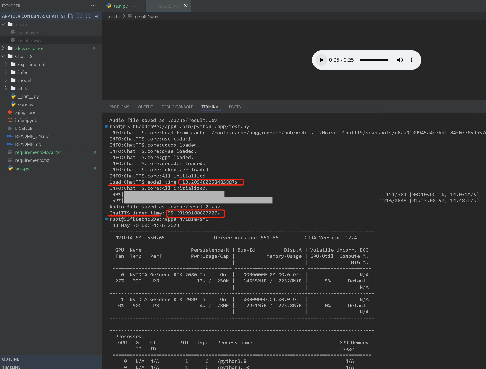

## ChatTTS本地测试


### 当前dev环境
- vscode
- vscode插件：`Dev Containers`，使用[devcontainer.json](.devcontainer/devcontainer.json)进入docker环境进行测试，需要修改[docker-compose.yml](.devcontainer/docker-compose.yml)中的`volumes`项目路径映射
- docker环境


### 运行推理（用vscode的`Dev Containers`插件进入容器后执行）
```shell
python test.py
```

### 结果展示

提示词片段：
```python
inputs_cn = """
chat T T S 真是是一款强大的对话式文本转语音模型啊！它有中英混读和多说话人的能力，听起来非常自然。
chat T T S 不仅能够生成自然流畅的语音，还能控制[laugh]笑声啊[laugh]，
停顿啊[uv_break]语气词啊等副语言现象[uv_break]。这个韵律超越了许多开源模型[uv_break]。
请注意，chat T T S 的使用应遵守法律和伦理准则，避免滥用的哦~ [uv_break]'
""".replace('\n', '')

params_refine_text = {
  'prompt': '[oral_2][laugh_0][break_4]'
} 
```

输出结果：

[result.mov](https://drive.google.com/file/d/1xXIkiaea48fsEvC1OsV2GiMbHnOO-L6f/view)

